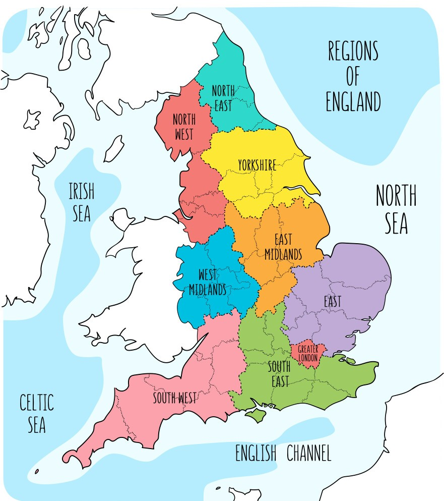
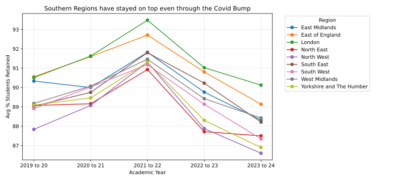
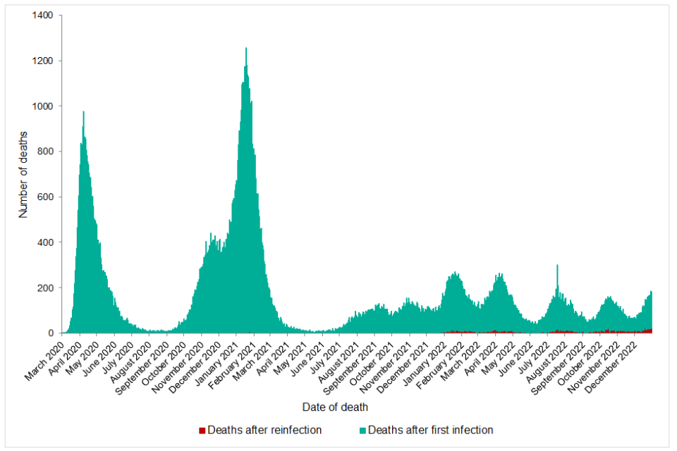
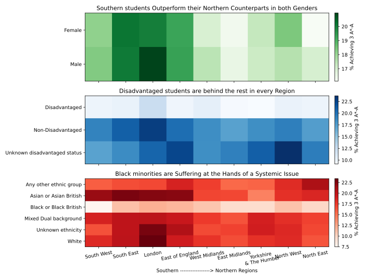
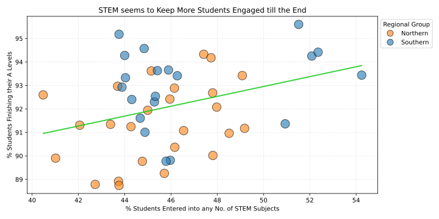

| LSE Data Science Institute | ME204 2025 | July 2025 |

# Do certain Regions of England lag in Further Education Perfomance compared to others?

What can be said about the commonly referred "North-South Divide"? How have "Further Education"* institutions performed across England in the last 5 years? And who is suffering the consequences on an unjust system? 

\* in the UK this means 16-18 Studies, not the same as "Higher Education" which means 18+ Studies like University, Apprenticeships etc.

---
## ✨ Introduction
1. I collected data from here: [EES Data Catalogue](https://explore-education-statistics.service.gov.uk/data-catalogue). The UK Department of Education use this site to share Open Datasets (downloadable CSVs) along with explanation guides.
2. After collecting I cleaned, processed and organised it before inserting it into a relational (SQLite) database which I designed and built.
3. By reading from this database, I performed numerous EDA (exploratory data analysis) and visualisations. The best of which are right here!

Also here is a reference for the locations of each region in case you are unfamiliar or, like me, appreciate a visual representation:

---
## 🔍 Findings 

### Exploring Retention over time across England
This graph clearly shows a common trend throughout the UK where the average percentage of students entering any type of 16-18 Studies rose and then fell over the last 5 years. The current academic year 2024-25 who have just finished has not yet had their data published by the DfE, however they would be the vital next datapoint to determine whether the trend line will plateau, recover or get worse. 

This shape is likely a result of Covid-19, having forced everyone to stay at home and be isolated until mid 2021, the cohort starting that September had more students hoping to re-engage with society and their peers at school, so retention increased. Alternatively, it could be a result of more students receiving higher grades in GCSEs as an outcome of the TAGs (teacher assessed grades - exam alternative) used at the time, allowing more of them to apply for Further Education, subsequently falling when regular exams and grade boundaries were reintroduced. Supported by this figure from a UK Gov Publication, below:
    

However while the overall trend is the same across England, there is a consistent pattern where Southern Regions such as London and East of England (green and orange) are consistently at the top of the pile whereas Northern Regions remain hanging below such as North East and West (red and purple).

This is a key insight and a common complaint of the British people, so I will use this North-South Divide going forward to showcase disparity between regions.

---
### Investigating Regional Performance using Characteristics
It is made very clear by the distinct colours, in what ways the North and South perform differently looking through the lenses of different student characteristics:

In particular:
1. Males and Females perform similarly, so the main disparity showcased is the aforementioned North-South Divide.
2. Disadvantaged students struggle no matter where they are educated. This is a categorical metric defined by DfE that takes into account factors like household income and home address etc.
3. Throughout England, there is a clear drop in top performers of Black ethnic background in every region.

Despite each subplot demonstrating slightly higher percentage of students as top performers (ie. darker colour) on the left side (South), there is a different story about student performance disparities in each. This certainly calls for attention and further analysis should be done to solve these types of, not just regional but, national issues.

---
### Investigating the Uptake of STEM Subjects
Looking specifically at those studying A levels and likely aiming for Higher Education (eg. University, Apprenticeships etc.), we can see an almost identical trend to before where the cluster (now made up of all genders in one) contains Northern Regions (orange) in the bottom half and Southern Regions (blue) in the top half with a similarly positive sloped trend-line (green).

In this case we can infer that when more students in a cohort are taking A level STEM subjects then a greater proportion of the students return for a second year of study and earn their A level qualifications. Perhaps they are more motivated to complete their studies and pursue Higher Education, alternatively they might be more inclined to do so since they are more academic in nature, having taken STEM subjects in the first place. More controversially, it may be down to the environment (in which more STEM subjects are being taken) that makes them feel more capable and therefore return for their second year of studies and complete the exams for their A levels.

---
## ⛳ Conclusion 

### 1. Answering the Reasearch Question:

I think, from the data and analysis I have conducted, that I have been able to showcase the differences between Regions of England and in particular identify, while it is not by a huge margin, that it is the Northern Regions that lag in Further Education Performance compared to the Southern Regions.

### 2. Challenges & Limitations:

The biggest challenge was designing and implementing the database as this was new to me and required attention to detail and patience to get everything to work seamlessly.

Many of the features and disparities I uncovered could be delved into further by looking on a smaller scale such as individual cities, or with additional data such as types of institutions etc. However, looking from a Regional perspective I was still able to uncover the well known North-South Divide and I showed the differences across this divide in a few different ways including through Retention, Regional Performance and the patterns surrounding different characteristic indicators as well as a deeper dive into the patterns around STEM subjects in particular.

### 3. Extending in the Future:

To extend this analysis in the future I could collect a wider range of data as mentioned beforehand in order to provide more indepth comparisons. Alternatively, I could extend it in a different way by incorporating new data for example from UCAS on University Subjects, Grades and Entry Pathways or from HESA (Higher Education Statistics Agency) on Graduate activities and work including Salary and Tax Bands etc. This type of analysis would allow me to chart educational tradjectories from beginning to end, allowing for a more insightful analysis, this would be the best way to step up this project in the future.

